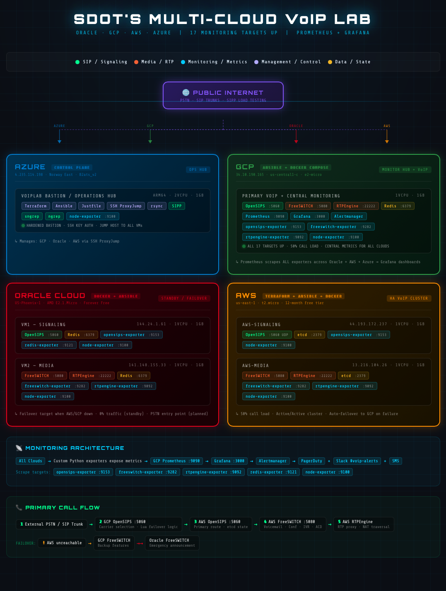

# Multi-Cloud VoIP Lab

Production-grade VoIP infrastructure deployed across **AWS, GCP, Oracle Cloud, and Azure** — fully automated with Terraform, Ansible, Docker, and a custom observability stack.

Built to bridge enterprise voice engineering with modern DevOps practices.

---

## Architecture



| Cloud | Role | Deployment Method |
|-------|------|-------------------|
| **Azure** | Control plane, bastion host, operations hub | Hardened bastion |
| **GCP** | Primary VoIP stack + central monitoring hub (50% traffic) | Docker Compose |
| **AWS** | Primary VoIP cluster (50% traffic) | Terraform + Ansible + Docker |
| **Oracle Cloud** | Load balancer + emergency fallback | Docker |

---

## Call Distribution & Failover

Under normal operation GCP and AWS each handle 50% of call traffic. Each cloud is capable of handling 100% independently:

```
Normal:
  Inbound → GCP OpenSIPS (50%) → GCP FreeSWITCH
  Inbound → AWS OpenSIPS (50%) → AWS FreeSWITCH

AWS down:
  Inbound → GCP OpenSIPS (100%) → GCP FreeSWITCH

GCP down:
  Inbound → AWS OpenSIPS (100%) → AWS FreeSWITCH

Both AWS + GCP down:
  Inbound → Oracle OpenSIPS → Oracle FreeSWITCH (plays emergency announcement)
```

Oracle does not handle production calls — it load balances between AWS and GCP and serves as a last-resort fallback.

---

## Stack

**VoIP / Media**
- [OpenSIPS](https://opensips.org/) — SIP proxy and session border controller
- [FreeSWITCH](https://freeswitch.org/) — Media server (voicemail, conferencing, IVR, ACD)
- [RTPEngine](https://github.com/sipwise/rtpengine) — RTP proxy and NAT traversal
- [Redis](https://redis.io/) — Registration backend and shared state

**Infrastructure / Automation**
- [Terraform](https://www.terraform.io/) — AWS infrastructure provisioning (VPC, EC2, security groups, EIPs)
- [Ansible](https://www.ansible.com/) — AWS configuration management and container deployment
- [Docker Compose](https://docs.docker.com/compose/) — GCP service orchestration
- [Docker](https://www.docker.com/) — Oracle service deployment
- [Justfile](https://just.systems/) — Task automation and workflow orchestration

**Observability**
- [Prometheus](https://prometheus.io/) — Centralized metrics collection on GCP (17 targets)
- [Grafana](https://grafana.com/) — Dashboards for OpenSIPS, FreeSWITCH, RTPEngine, system
- [Alertmanager](https://prometheus.io/docs/alerting/latest/alertmanager/) — Alert routing to Slack
- Custom Python exporters — opensips-exporter (:9153), freeswitch-exporter (:9282), rtpengine-exporter (:9092)

**Testing**
- [SIPP](https://sipp.sourceforge.net/) — SIP load testing and regression testing
- Custom SIPP scenario framework with Justfile orchestration

---

## Repository Structure

```
multi-cloud-voip-lab/
├── aws/
│   ├── terraform/          # VPC, EC2, security groups, EIPs
│   └── ansible/            # Roles: OpenSIPS, FreeSWITCH, RTPEngine, Redis, Docker, monitoring
├── gcp/
│   ├── opensips/           # OpenSIPS SIP proxy config
│   ├── prometheus/         # Prometheus config, alert rules
│   └── grafana/            # Dashboards and datasources
├── oracle/
│   ├── vm1-signaling/      # OpenSIPS config
│   └── vm2-media/          # FreeSWITCH, RTPEngine configs
├── azure/
│   ├── sipp-test-framework/  # SIPP testing framework with Justfile
│   ├── sipp-scenarios/       # UAC scenarios (basic, redirect, media, load)
│   └── scripts/              # Exporter deployment and automation scripts
├── monitoring/
│   ├── opensips-exporter/    # Custom Python Prometheus exporter
│   ├── freeswitch-exporter/  # Custom Python Prometheus exporter
│   └── rtpengine-exporter/   # Custom Python Prometheus exporter
└── docs/
    └── architecture/         # Architecture diagrams
```

---

## Monitoring Architecture

```
All Clouds (exporters) → GCP Prometheus :9090 → Grafana :3000
                                    ↓
                             Alertmanager → Slack #voip-alerts
```

**Scrape targets across all clouds:**

| Exporter | Port | Cloud |
|----------|------|-------|
| opensips-exporter | 9153 | GCP, AWS, Oracle |
| freeswitch-exporter | 9282 | GCP, AWS, Oracle |
| rtpengine-exporter | 9092 | GCP, AWS, Oracle |
| redis-exporter | 9121 | GCP, Oracle |
| node-exporter | 9100 | All clouds |

**17 monitoring targets — all green.**

---

## Custom Prometheus Exporters

Three Python exporters written from scratch to expose VoIP-specific metrics not available in standard exporters:

- **opensips-exporter** — SIP dialog counts, transaction rates, memory usage via MI FIFO interface
- **freeswitch-exporter** — Active channels, call duration, codec stats via ESL
- **rtpengine-exporter** — Active sessions, packet loss, jitter via control socket

All exporters use bridge networking with explicit port mapping and run as Docker containers with `--restart unless-stopped`.

---

## Infrastructure Details

### AWS (Terraform + Ansible + Docker)
- 2x EC2 t3.micro instances (us-east-1)
- Custom VPC with public subnet, internet gateway, route tables
- Security groups with least-privilege rules per service
- Elastic IPs for stable addressing
- AMI pinned to prevent unintended instance replacement
- Handles 50% of call traffic, scales to 100% if GCP goes down

### GCP (Docker Compose)
- e2-micro (us-central1-c)
- Central monitoring hub — Prometheus scrapes all clouds
- Full VoIP stack + Grafana dashboards + Alertmanager
- Handles 50% of call traffic, scales to 100% if AWS goes down

### Oracle Cloud (Docker)
- 2x AMD E2.1.Micro (US-Phoenix-1) — forever free tier
- VM1: OpenSIPS + Redis (signaling)
- VM2: FreeSWITCH + RTPEngine + Redis (media)
- Load balances between AWS and GCP under normal operation
- Last-resort fallback — plays emergency announcement if both AWS and GCP are unreachable

### Azure (Control Plane)
- Standard_B2ats_v2 ARM64 (Norway East)
- Hardened bastion host — SSH key auth only, no passwords
- SSH ProxyJump to all cloud VMs
- Terraform + Ansible + Justfile operations hub
- SIPP load testing and SIP analysis (sngrep, ngrep)

---

## Security Architecture

- **Bastion host pattern** — all infrastructure access routes through Azure
- **SSH ProxyJump** — no direct public SSH to VoIP nodes
- **Key-based auth only** — no password authentication anywhere
- **Least-privilege security groups** — per-service port restrictions
- **Secrets management** — no credentials in version control (`.gitignore` enforced)

---

## Key Technical Challenges Solved

- Fixed OpenSIPS `onreply_route`/`failure_route` syntax requiring explicit block names (`[DEFAULT]`)
- Resolved Docker exporter bridge networking — must use explicit port mapping, not `--network host`, on AWS
- Debugged SIP ACK routing failures and SIPP blank Request-URI scenarios
- Fixed OpenSIPS container healthcheck case mismatch (`Up Time` vs `Up time`)
- Pinned Terraform AMI to prevent EC2 instance replacement on `terraform apply`
- Built Justfile-based workflow for exporter deployment, rsync, and lab automation

---

## About

Built by a Senior Voice Engineer transitioning into DevOps/Platform Engineering. This lab bridges 10+ years of enterprise VoIP experience (Ribbon SBC, Metaswitch Perimeta, OpenSIPS, FreeSWITCH) with modern infrastructure automation.

**Technologies:** OpenSIPS · FreeSWITCH · RTPEngine · Terraform · Ansible · Docker · Prometheus · Grafana · Python · Justfile · AWS · GCP · Azure · Oracle Cloud
